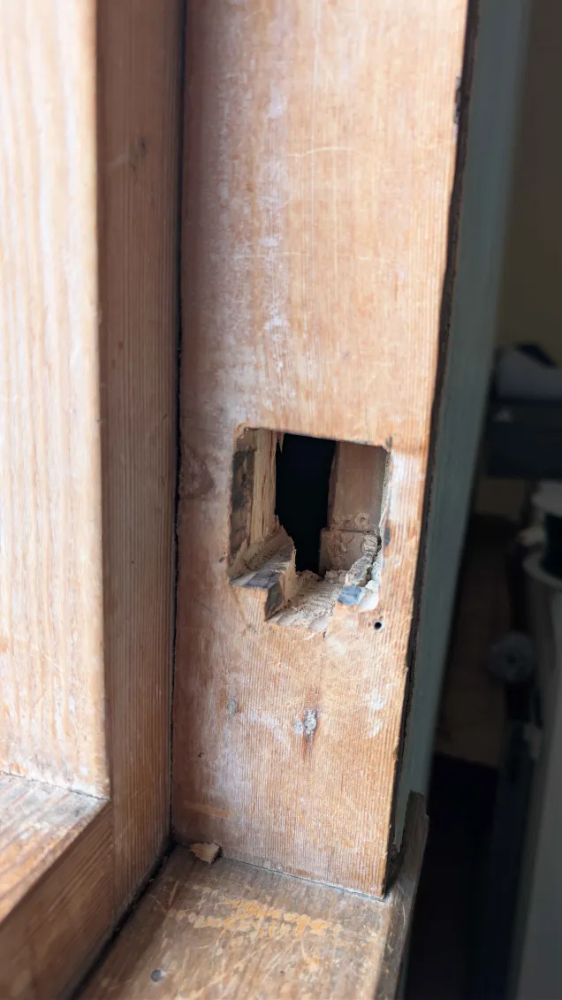
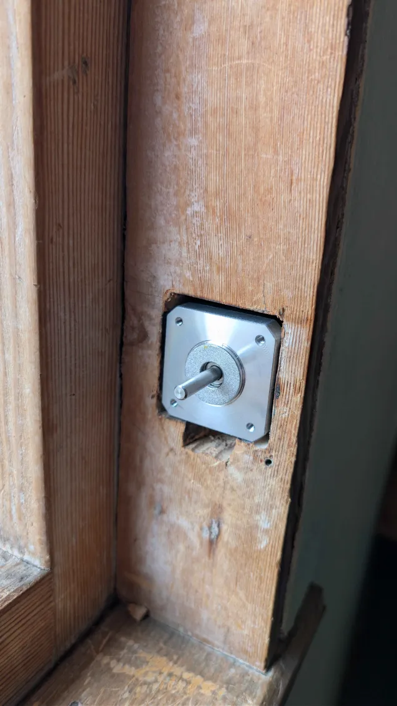
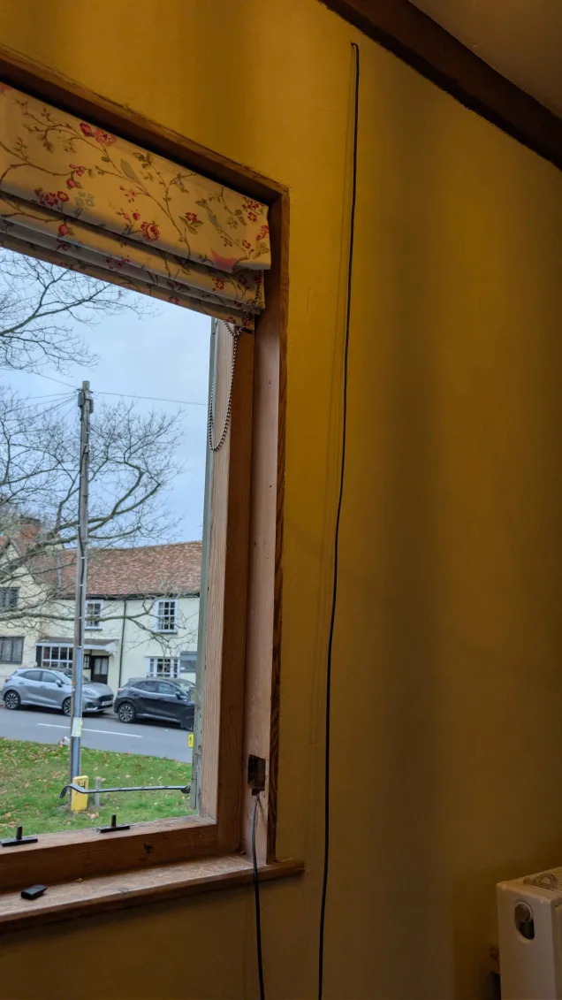
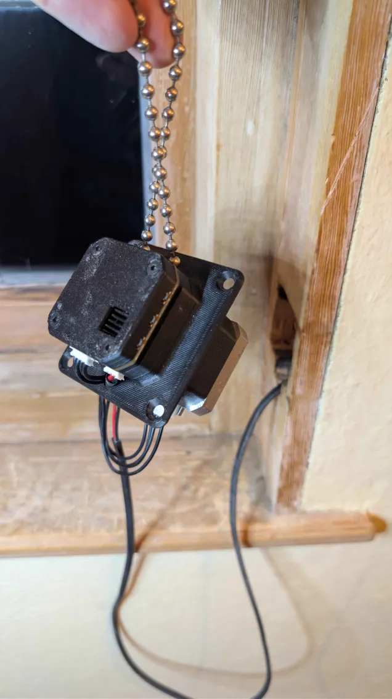
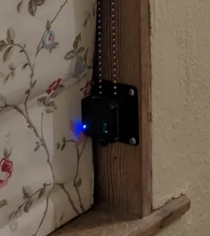

# Installation

## 1. Position and Mark

Mount a gear on the Motor Cavity Template and find where it sits on the side of the window frame, and mark the location to cut. The blind cord doesn't need to be tight; a little bit of slack is fine.

## 2. Cut Motor Cavity

Cut the hole for the motor in the window frame and ensure that the motor can sit completely inside so that its face is flush with the frame, with space for the motor wires.

## 3. Route Power Cable

Feed the power cable through the wall cavity to reach the motor from within the wall.

## 4. Terminate Power Cable

Bring the power cable through the gap in the base plate alongside the motor cable, and terminate it in a 3-pin JST-PH plug.

## 5. Connect Assembly

Fit the blind cord to the complete assembly and connect the power cable as shown.

## 6. Mount Assembly

Mount the complete assembly in the wall cavity and screw in the four corners with self-tapping screws.

