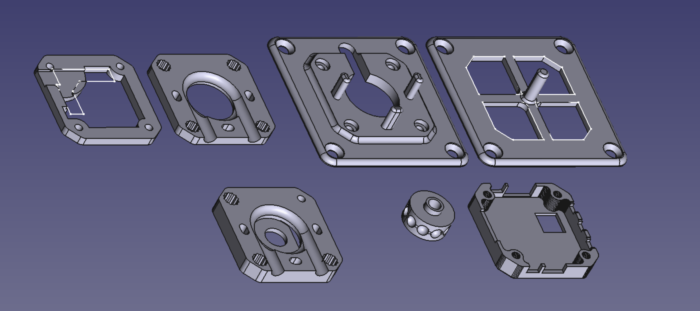
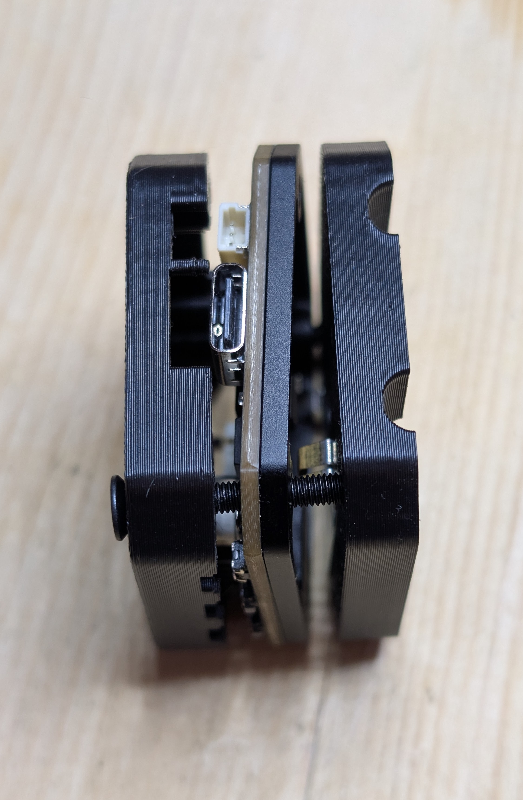
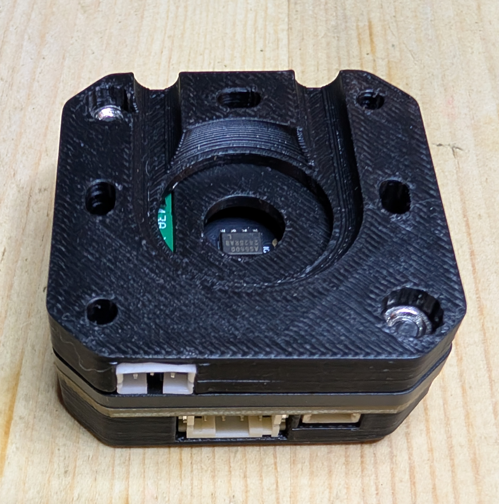
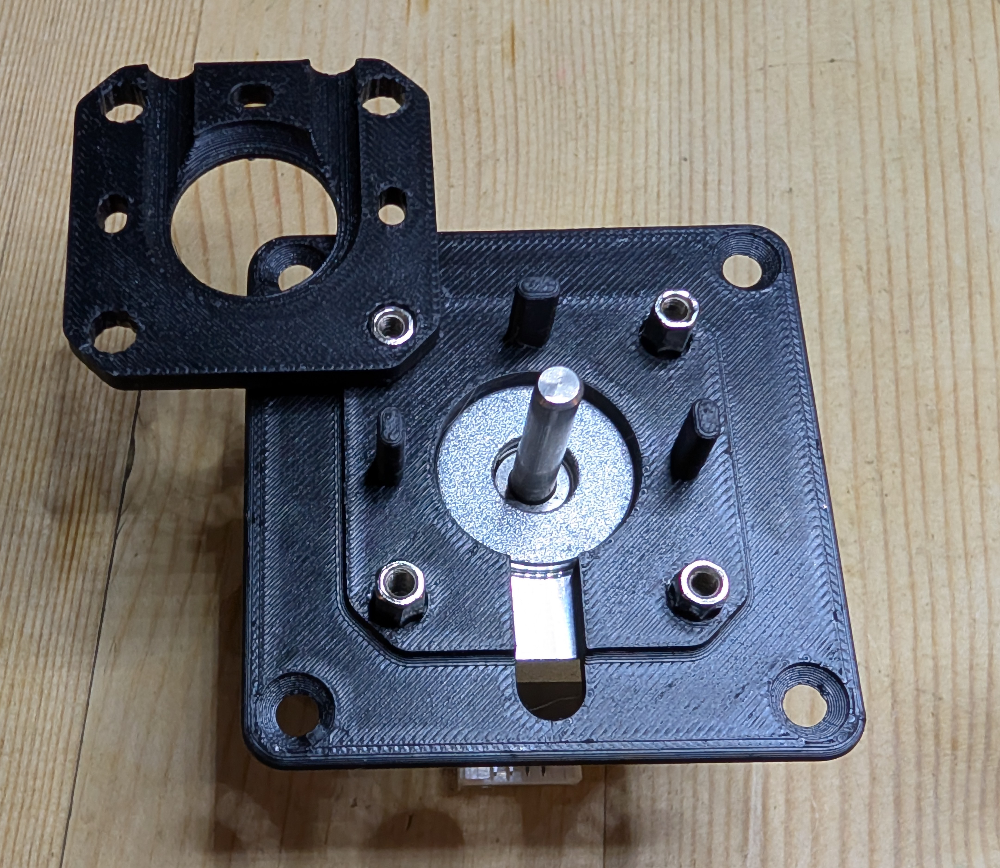
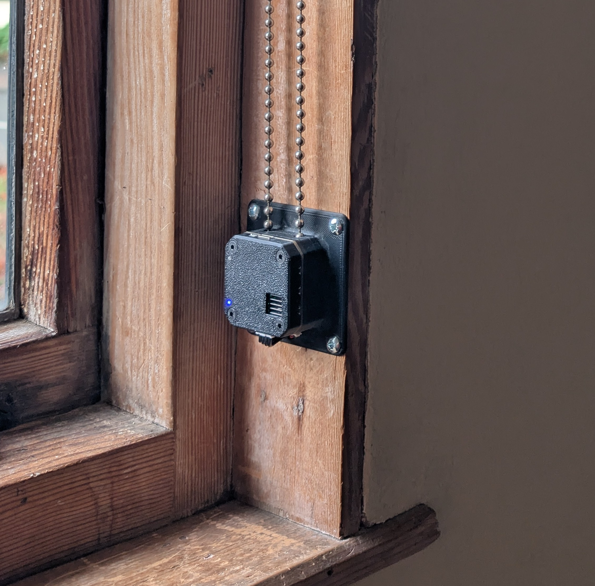

# PD-Stepper-Blinds

ESPHome-based automatic blind control system using the [PD-Stepper](https://github.com/joshr120/PD-Stepper) controller board by ThingsbyJosh.com.

## Overview

This project provides a complete solution for automating window blinds with precise stepper motor control. It includes 3D-printable mounting hardware, a custom power distribution PCB, and ESPHome configuration for seamless Home Assistant integration.

## Hardware

### Components

- **PD-Stepper Kit** - ESP32-based stepper motor controller (includes board, encoder magnet, aluminium spacer and heatsunk)
- **Stepper Motor** - NEMA 17 or compatible
- **Custom Power PCB** - Distributes power to the PD-Stepper board via spring terminals connected to internal pads
- **3D-Printed Mounting Hardware** - Complete blind mounting assembly
- **M3 Hex Standoffs and Nuts** - For assembly ([example](https://www.amazon.co.uk/dp/B08FZKLYSB))
- **M3 Countersunk Bolts** - For mounting ([example](https://www.amazon.co.uk/dp/B0CPDQJ7ZF))
- **JST-PH 2.0mm Sockets** - 3-pin connectors for power PCB ([example](https://www.amazon.co.uk/dp/B0CDG95RDT))
- **2mm Acrylic Rod** - For light guides ([example](https://www.amazon.co.uk/dp/B0DQ1757SP))

### Power Distribution

Power is supplied through a custom PCB that connects to internal pads on the PD-Stepper board using spring terminals, eliminating the need for external connectors.

## 3D Design

The mounting hardware consists of multiple printed parts that work together to create a complete blind mounting assembly.

### Parts

**Motor Housing and Gear**
- **BasePlate** - Main mounting base
- **Outer** - Outer housing component
- **Inner** - Inner housing component
- **Cover** - Top cover
- **Gear** - Drive gear for blind mechanism

**Installation Template**
- **Motor Cavity Template** - Template for positioning screw holes and motor cutout in the window frame

**PCB Assembly Jig**
- **JigOuter** - Assembly jig outer piece
- **JigSpacer** - Assembly jig spacer (for soldering socket onto PCB)

### Design Files

- **Source File** - `3d-design/BlindMount.FCStd` (FreeCAD format)
- **STL Files** - Individual parts in `3d-design/STL/`
- **3MF Files** - Individual parts in `3d-design/3mf/`

## Assembly

### 1. Power PCB Preparation

See [power-pcb/README.md](power-pcb/README.md) for PCB assembly instructions.

### 2. Outer Assembly

- Prepare the 3D-printed Outer piece by pushing two half-width M3 nuts into diagonally opposed holes, then pushing the power PCB into its slot on the other side.
- Attach the PD-Stepper board to the aluminium spacer using the sticky heat transfer pad, and loosely place the Cover piece on top.
- Apply the Outer piece to the back of the PD-Stepper board so that the spring terminals make contact with the power and NTC pads.
- Screw together using two 15mm countersunk bolts.
- Cut sections of the acrylic rod to use as light guides, and push them gently into the holes for the blue and red LEDs.
- Finally, affix the heatsink to the full assembly through the gap in the Cover.

| Exploded View | Bottom | Top |
|---------------|--------|-----|
|  |  |  |

### 3. Build Motor Cable

- Using JST-PH 2.0 connectors, build a 4-pin to 6-pin cable which works for your motor, matching either the straight-through or crossover cables from the PD-Stepper kit which won't be long enough to reach.
- Test the motor and cable using your completed outer assembly.

### 4. Motor Housing

- Pass the motor cable through the cable hole, then attach the Base Plate to the motor using the hex standoffs. Use two short (5-6mm) standoffs in the corners where the Outer assembly is screwed together, and two longer (8mm) standoffs in the corners which will be used to screw the Inner to this piece.
- You will have to turn the standoffs by a few degrees to the correct orientation such that the Inner piece fits over them. The Inner piece itself can be used as a spanner for that purpose. The Inner piece then pushes over the standoffs and guide posts.
- Offer the Outer assembly up to this to check that it all fits together.

| Aligning the hex standoffs | Motor Assembly |
|----------------------------|----------------|
|  |  |

### 5. Gear Installation

- Push the Gear onto the motor shaft, and push the encoder magnet from the PD-Stepper kit into the front of the Gear as shown.

### 6. Final Assembly

- Two 25mm bolts go through the other corners of the Outer assembly to secure it to the Base Plate, with the blind cord inside.

## Installation

For instructions on mounting the completed assembly into your window frame, see [INSTALLATION.md](INSTALLATION.md).

## Programming

ESPHome configuration examples are provided in the `esphome/` directory. The `landing-blind-1.yaml` file shows a complete configuration with the following substitutions:

- **name** - Device name for ESPHome and Home Assistant
- **encoder_closed_pos** - Full blinds length in encoder counts (adjust to suit your setup)
- **encoder_direction** - Which direction is towards 'closed' (1 or -1)
- **motor_direction** - Motor direction relative to encoder (1 or -1)
- **microsteps** - Microstepping setting for the stepper driver
- **run_current** - Motor run current (e.g., "100m" for 100mA)
- **max_speed** - Maximum motor speed
- **stallguard_threshold** - StallGuard threshold for stall detection
- **pd_voltage** - Power delivery voltage (unused)

On power-up, the controller will assume that the blinds are open. The first time it is asked to open the blinds, it will perform a rehoming operation, running at half-speed until it stalls. It will close the blinds at sunset, and open the blinds at 07:30AM or sunrise, whichever is later.

You can tweak the current, speed and stallguard settings to suit your blinds and motor, so that the stall is detected correctly. The motor_direction may differ for supposedly identical installations, if your motor cables are wired differently. Some notes on calibration are in the top of the [`blind.yaml`](esphome/blind.yaml) file.

The third pin on the power connector is for a reed switch, which connects that GPIO pin to ground when the blind is fully open. This is not necessary, because rehoming works well with properly calibrated stall detection anyway. One thing that a reed switch would allow is for the device to be *sure*, on startup, that it is at the home position and to initiate a rehoming if not. Rehoming on startup is disabled because when starting from the home position, the immediate stall... well, isn't immediate enough, and is noisy.
