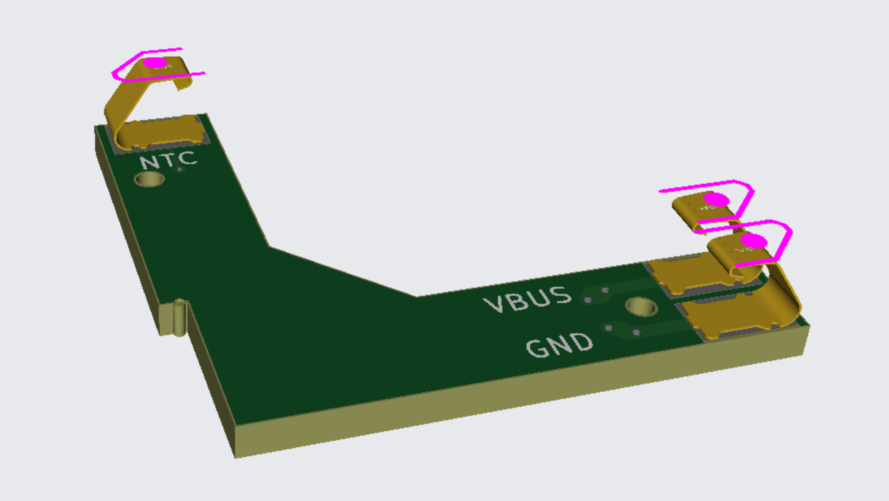
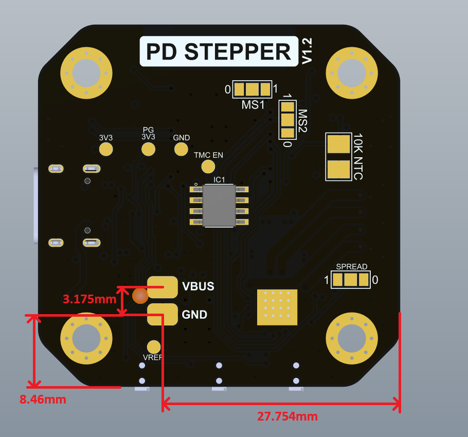
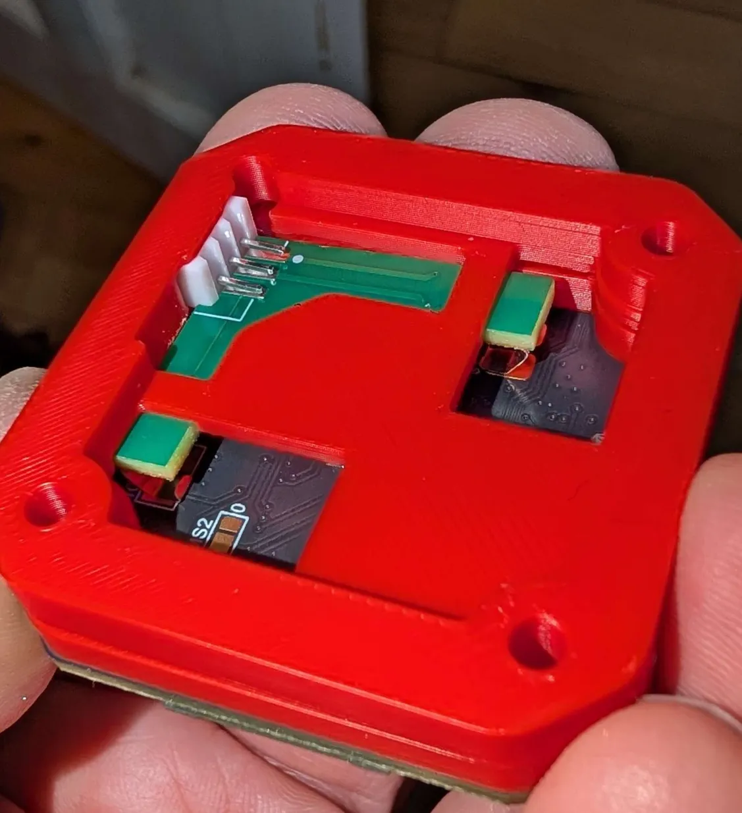
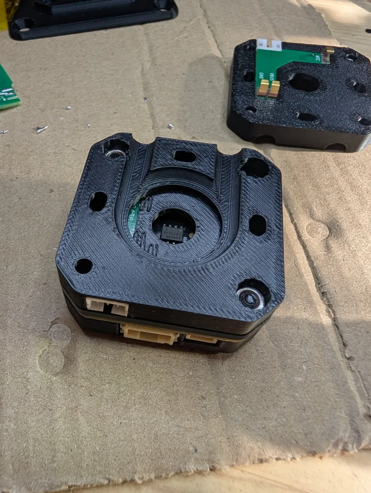
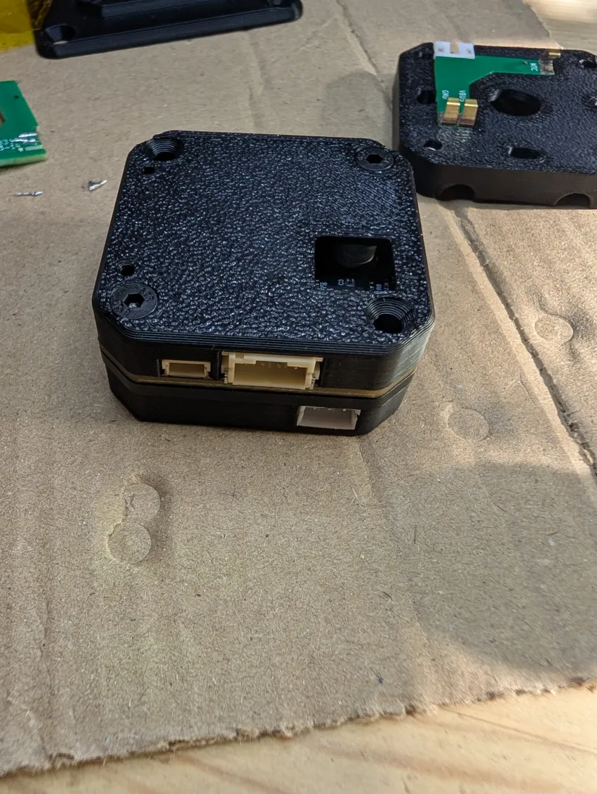
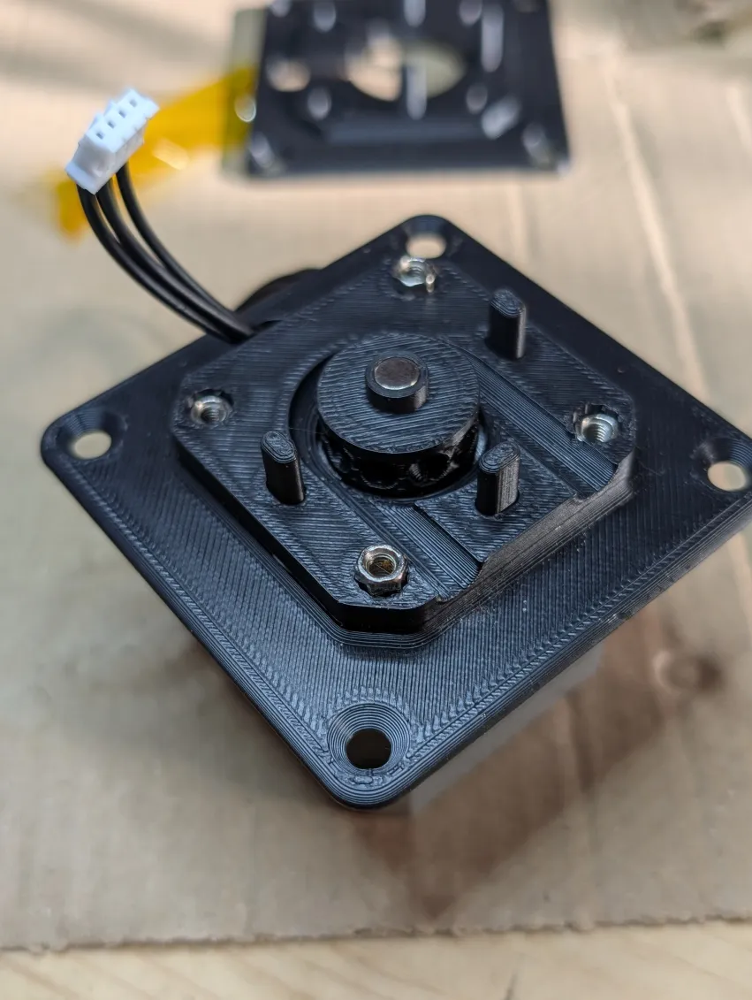
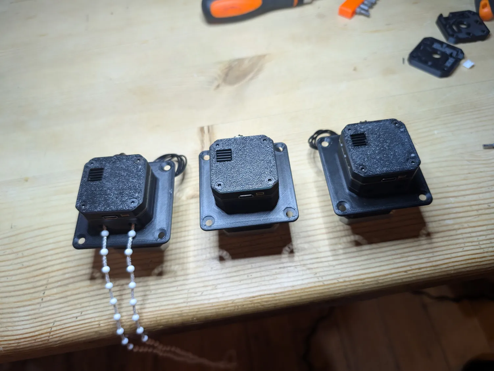

# PD-Stepper-Blinds

ESPHome-based automatic blind control system using the [PD-Stepper](https://github.com/joshr120/PD-Stepper) controller board by ThingsbyJosh.com.

## Overview

This project provides a complete solution for automating window blinds with precise stepper motor control. It includes 3D-printable mounting hardware, a custom power distribution PCB, and ESPHome configuration for seamless Home Assistant integration.

## Hardware

### Components

- **PD-Stepper Controller Board** - ESP32-based stepper motor controller
- **Stepper Motor** - NEMA 17 or compatible
- **Custom Power PCB** - Distributes power to the PD-Stepper board via spring terminals connected to internal pads
- **3D-Printed Mounting Hardware** - Complete blind mounting assembly
- **M3 Hex Standoffs and Nuts** - For assembly ([example](https://www.amazon.co.uk/dp/B08FZKLYSB))
- **M3 Countersunk Bolts** - For mounting ([example](https://www.amazon.co.uk/dp/B0CPDQJ7ZF))
- **JST-PH 2.0mm Sockets** - 3-pin connectors for power PCB ([example](https://www.amazon.co.uk/dp/B0CDG95RDT))

### Power Distribution

Power is supplied through a custom PCB that connects to internal pads on the PD-Stepper board using spring terminals, eliminating the need for external connectors.

## Power PCB

The custom power distribution PCB is an optional component that provides two key features:

- **Internal Power Delivery** - Supplies power directly to internal pads on the PD-Stepper board via Harwin S1761-42R spring terminals, bypassing the USB-C connector
- **Reed Switch Connection** - Provides a connector for a reed switch to detect when the blinds are fully closed

### Design Files

KiCad project files are located in the `power-pcb/` directory. Gerber files for fabrication are available in `power-pcb/Gerber/`.

For PCB assembly through JLCPCB, the `jlcbom.csv` file contains the spring terminal part number in the required format.

## 3D Design

The mounting hardware consists of multiple printed parts that work together to create a complete blind mounting assembly.

### Parts

**Motor Housing and Gear**
- **BasePlate** - Main mounting base
- **Outer** - Outer housing component
- **Inner** - Inner housing component
- **Cover** - Top cover
- **Gear** - Drive gear for blind mechanism

**Installation Template**
- **Motor Cavity Template** - Template for positioning screw holes and motor cutout in the window frame

**PCB Assembly Jig**
- **JigOuter** - Assembly jig outer piece
- **JigSpacer** - Assembly jig spacer (for soldering socket onto PCB)

### Design Files

- **Source File** - `3d-design/BlindMount.FCStd` (FreeCAD format)
- **STL Files** - Individual parts in `3d-design/STL/`
- **3MF Files** - Individual parts in `3d-design/3mf/`

## Assembly

### 1. Power PCB Preparation

The power PCB is designed to make contact with the back of the PD-Stepper board, using the terminals shown.

The JST-PH socket is fitted at right angles to the board with its pins laying flat on the copper, so manufacturers like JLCPCB won't be able to build that. Using the jig as shown to position the socket and PCB, solder them by hand.

### 2. Outer PCB Assembly

First, attach the PD-Stepper board to the aluminium spacer using the sticky heat transfer pad, and fit the cover piece on top. Then fit the power PCB into the outer piece, and sandwich them together so that the spring terminals make contact. Screw that piece together using two 15mm bolts and half-width M3 nuts. Finally, affix the heatsink to the full assembly through the gap in the cover.

### 3. Build Motor Cable

Using JST-PH 2.0 connectors, build a 4-pin to 6-pin cable which works for your motor, matching either the straight-through or crossover cables from the PD-Stepper kit which won't be long enough to reach. Test the motor using your completed outer assembly.

### 4. Motor Housing

Pass the motor cable through the cable hole, then attach the base plate to the motor using two 5mm standoffs and two 6mm standoffs. The outer piece then pushes over the standoffs and guide posts.

### 5. Gear Installation

Push the gear onto the motor shaft, and push the encoder magnet from the PD-Stepper kit into the front of the gear as shown.

### 6. Final Assembly

Two 25mm bolts go through the other corners of the outer assembly to secure it to the backing plate, with the blind cord inside.

