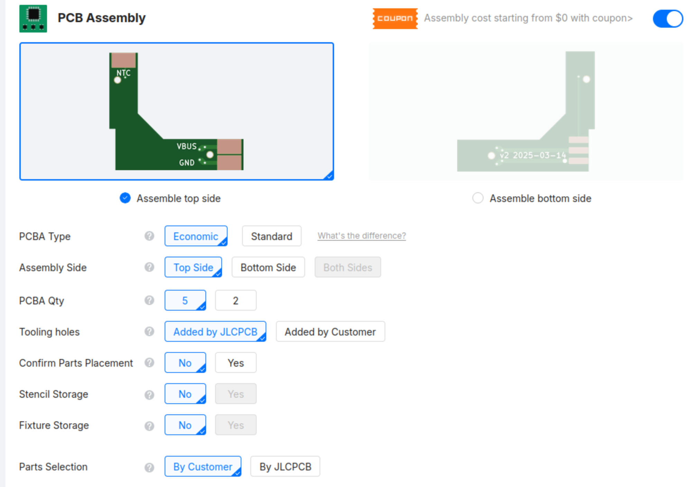
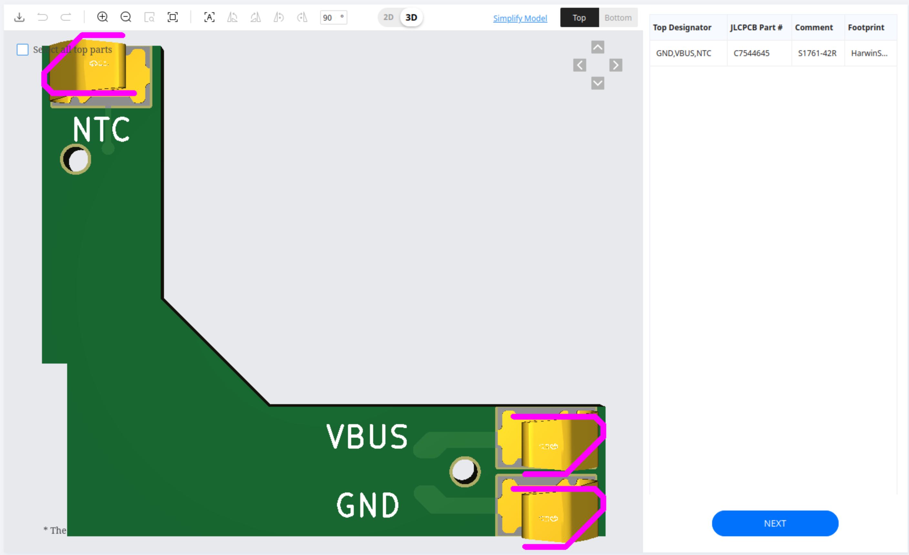

# JLCPCB Assembly Instructions

## Ordering Process

### Step 1: Prepare Gerber Files
- Create a file `Gerber.zip` containing the contents of the `Gerber/` directory

### Step 2: Create a PCB Assembly project
- Login to JLCPCB account
- Navigate to [https://jlcpcb.com/pcb-assembly](https://jlcpcb.com/pcb-assembly) and click 'Get Started'
- Select 'Add gerber file' and upload the Gerber.zip file
- Check 'PCB Assembly' near the bottom
- Select Tooling holes: Added by Customer, and Confirm Parts Placement: Yes

- Click 'NEXT' on the right hand side

### Step 3: Upload BOM
- Click 'Bill of Materials' then 'Add BOM File', and upload [jlcbom.csv](jlcbom.csv)
- Click 'Add CPL File' and upload [jlccpl.csv](jlccpl.csv)
- Click 'Process BOM and CPL'
- It'll say "No part selected" despite the BOM explicitly containing the JLCPCB part number
- Click 'Search' and it'll show you the only matching part. Click 'Select' on it
- Review the placement of the components, which should appear as below, and click 'NEXT'

### Step 4: Checkout
- Select the item in your shopping cart and check out

